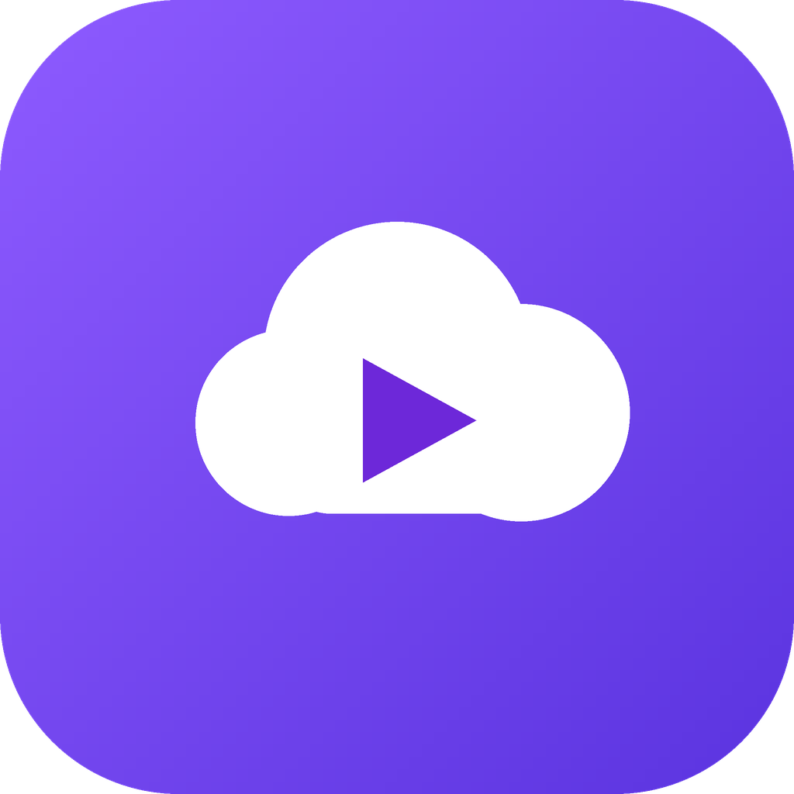
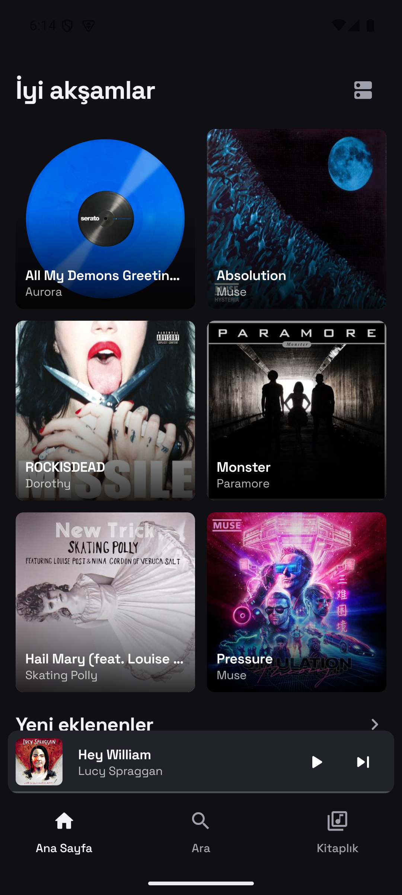
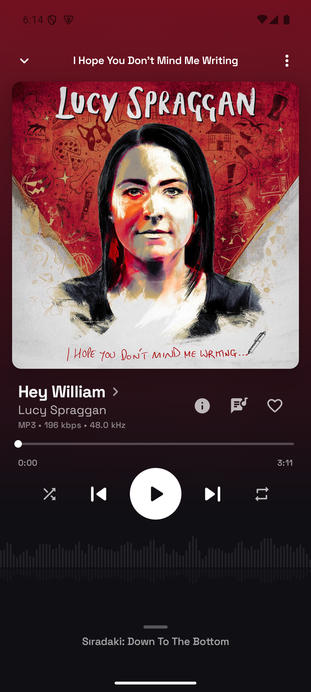
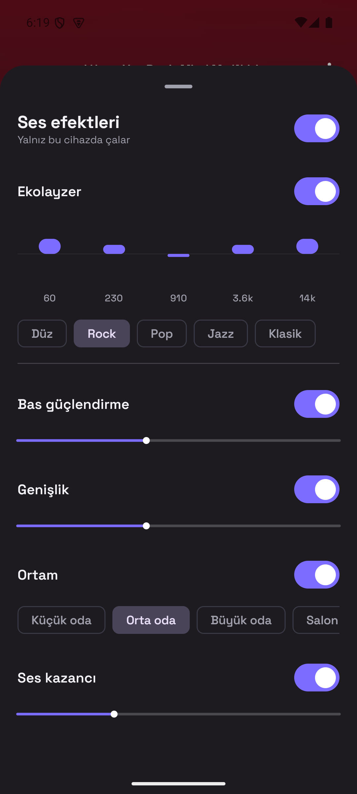
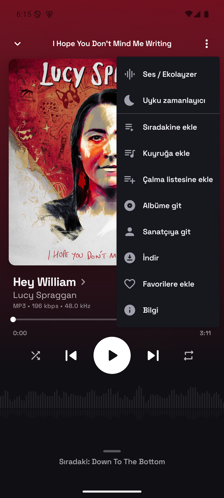

<p align="center">
  
</p>

<h1 align="center">NaviCloud</h1>

<p align="center">
  <b>Your own music, on every device.</b><br/>
  A modern, fast and polished music client for Navidrome / Subsonic — <b>Android</b> and <b>Windows</b>.
</p>

<p align="center">
  
  
  
  
</p>

<p align="center">
  <b>English</b> · <a href="README-tr.md">Türkçe</a>
</p>

---

<p align="center">
  
  &nbsp;
  
  &nbsp;
  
  &nbsp;
  
</p>

<p align="center"><sub>Home · Now playing · Equalizer &amp; audio effects · Player menu</sub></p>

---

## Features

### 🎧 Playback
- Gapless playback, queue management, drag-and-drop reordering
- **Equalizer** (5 preset types) + **audio effects**: bass boost, stereo width, ambience (reverb), gain
- **Sleep timer**: timed (10/20/30/60/90 min) or "stop at end of track/queue"
- Synced lyrics, favorites and scrobbling
- Track technical info (codec / bitrate / sample rate / source → output)

### 📡 Remote control (LAN)
- **Spotify Connect–style** remote: pick a device and control it, or hand playback off between devices
- Fully **symmetric** — every client can control and be controlled
- **mDNS** device discovery on the local network, **PIN** or shared-password pairing, "forget device"
- Self-hosted and **LAN-only**: nothing leaves your network

### 📥 Offline &amp; cache
- Song downloads + **offline mode** (plays only from downloads)
- Smart caching: metadata (Room), artwork (Coil), stream (LRU) — separate from downloads
- Prefetch of the next track, Wi-Fi-first data usage

### 🖥️ Desktop (Windows)
- **libmpv** audio engine (embedded), tablet layout + side sidebar
- **Windows media keys + control center / flyout** integration (SMTC): artwork, title, artist, controls
- System tray + "minimize to tray on close"
- Always-on-top **mini player** (waveform seek bar)

### 🎨 Design
- Spotify / YT Music–grade dark theme; palette derived from the cover art
- Single-surface morphing player (mini ↔ full), ambient spectrum

### 🌐 Languages
- **English** and **Turkish** (follows the system locale, switchable in Settings)

---

## Architecture

A single codebase with Kotlin Multiplatform + Compose Multiplatform:

| Module | Contents |
|--------|----------|
| `:shared` | Model, networking (Subsonic/OpenSubsonic), repository, queue core, audio contract, i18n catalog |
| `:sharedUi` | All screens/components (Compose MP) — shared by Android + desktop |
| `:app` | Android: Media3/ExoPlayer, Hilt, Room, `android.media.audiofx` |
| `:desktop` | Windows: libmpv (JNA), system tray, mini player, SMTC |
| `desktop/smtc-helper` | Rust (windows-rs) — native SMTC helper |

Audio/EQ behavior is defined once in a platform-independent contract (presets/bands/ranges); both engines (audiofx ↔ mpv) apply the same values.

---

## Releases &amp; CI

- Every `vX.Y.Z` tag push makes GitHub Actions build the **Android APK** + **Windows installer** and upload them to the Release.
- A fast compile check (`CI`) runs on pushes/PRs to feature branches.
- Download the latest builds from the [Releases](../../releases) page.

```bash
# publish a new version
git tag v1.3.1 && git push origin v1.3.1
```

> Note: the Android APK is currently signed with a debug key (installable via adb). For store distribution, add your own keystore as a CI secret.

---

## Local build

```bash
# Android (JDK 17)
./gradlew :app:assembleRelease

# Desktop distribution (JDK 21 — jpackage)
./gradlew :desktop:createDistributable
# Put libmpv-2.dll under desktop/packaging/windows-x64/ (shinchiro/zhongfly build)
```

---

## License

[](LICENSE)

NaviCloud is licensed under the **GNU General Public License v3.0** — see [LICENSE](LICENSE). The desktop build bundles GPL builds of libmpv + FFmpeg, so the whole project is GPLv3.

The full list of open-source components is inside the app under **Settings → About → Open source licenses**. Highlights: Compose Multiplatform, Coil, OkHttp, Media3 (Apache-2.0); libmpv, FFmpeg (GPL-2.0+); windows-rs (MIT/Apache-2.0).

<p align="center"><sub>Made with ❤️, powered by open source.</sub></p>
